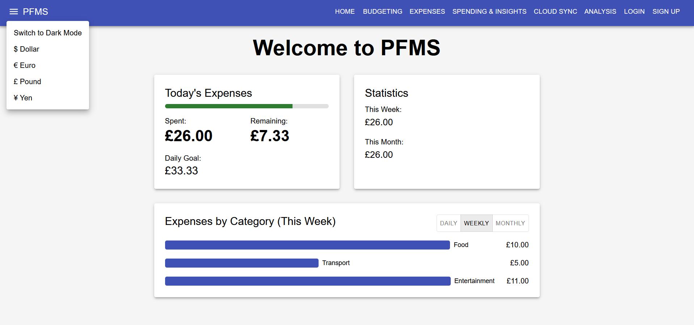
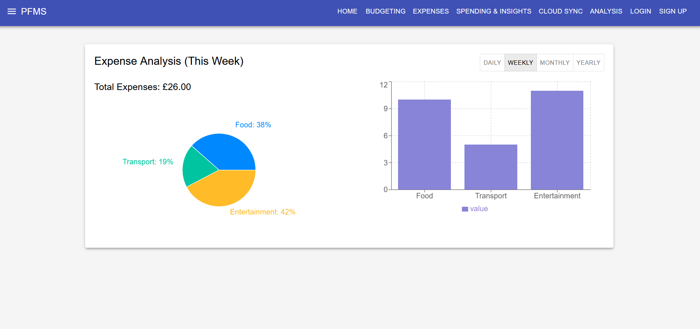

# pfms

Personal Financial Management System – expenditure tracking and savings

This project was developed as my final year project for university. It’s a full-stack app built with React (frontend) and Node.js (backend) to help users manage expenses and savings easily.


## Features

- User authentication (login/signup)  
- Expense tracking with categories  
- Monthly budgeting and daily goal calculation  
- Savings insights and analytics  
- Light/Dark theme toggle  
- Currency support (USD, EUR, GBP, JPY)  
- Cloud sync for persistent storage  
- Bar chart visualization of expenses  



## Tech Stack

- Frontend: React (JavaScript), Material-UI, CSS
- Backend: Node.js, Express  
- Database: MySQL + AWS RDS integration (Relational Database Service)
- Storage: LocalStorage (with optional cloud sync)  

## Installation

1. **Clone the repository**  
```bash
git clone https://github.com/usafdev/pfms.git
cd pfms
```
2. **Install and run the frontend**
```bash
cd frontend
npm install
npm start
```
- The frontend will start on http://localhost:3000.
3. **Install and run the backend**
```bash
cd ../backend
npm install
node index.js
```
- The backend server will start (check index.js for the port, usually 8080).
4. **Access the app**
- Open your browser and go to http://localhost:3000
